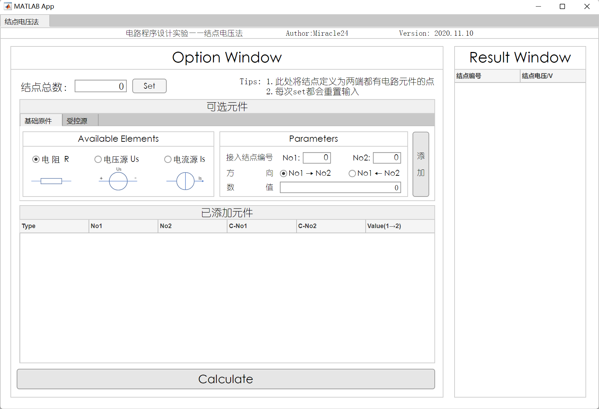
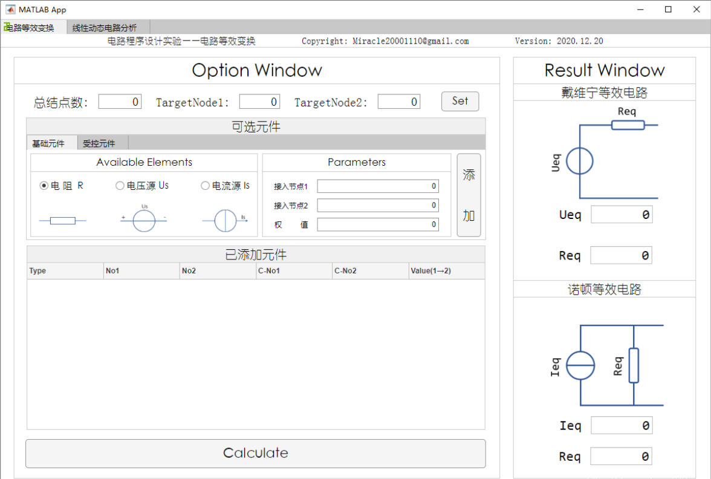
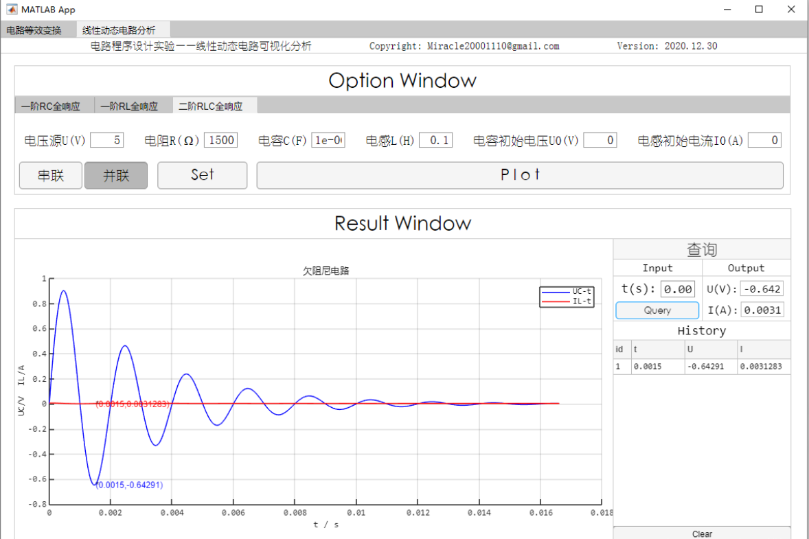
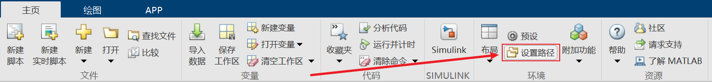
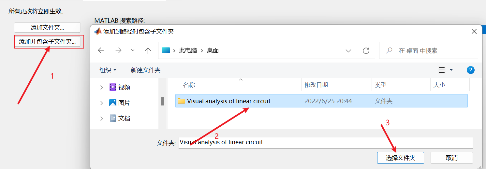
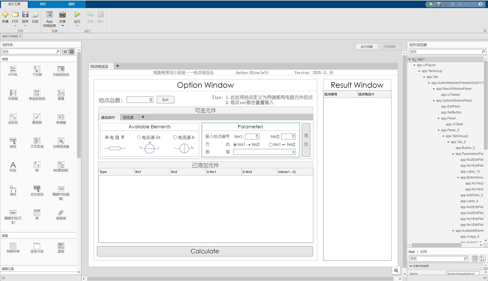

# 线性动态电路可视化分析

#### 基于Matlab App Designer实现

## 编程要求

- 实现一阶RC、RL电路，二阶RLC电路的零状态、零输入、全响应分析
- 实现可视化分析，结果以动画、图片等可视化方式呈现

## 输入

任意形式电路图

## 实现

分为两步实现：

1. 电路的等效变换，应用戴维宁/诺顿等效变换化简电路
2. 对简化后的电路进行分析并做图

### 电路等效变换

- 电路等效变换采用**结点电压法**计算等效电压(**U<sub>eq</sub>**)
- 对目标结点间手动加入已知阻值电阻(**R<sub>0</sub>**)再次计算电压差(**tU**)， 由如下公式计算(**R<sub>eq</sub>**)

$$
tI = \frac{tU}{R_0}
$$

$$
R_{eq} = \frac{tU}{tI}-R_0
$$

- 诺顿等效可通过戴维宁等效计算，此处不再赘述

### 电路分析并做图

原理略

## 最终APP实现

### 节点电压法APP



### 等效变换+线性动态电路分析APP





## 下载使用


## 修改&复用

1. 下载源码

   ```shell
   git clone
   ```

2. 将路径整个文件路径添加到matlab路径中

   

   

3. 使用Matlab App Designer打开

   


